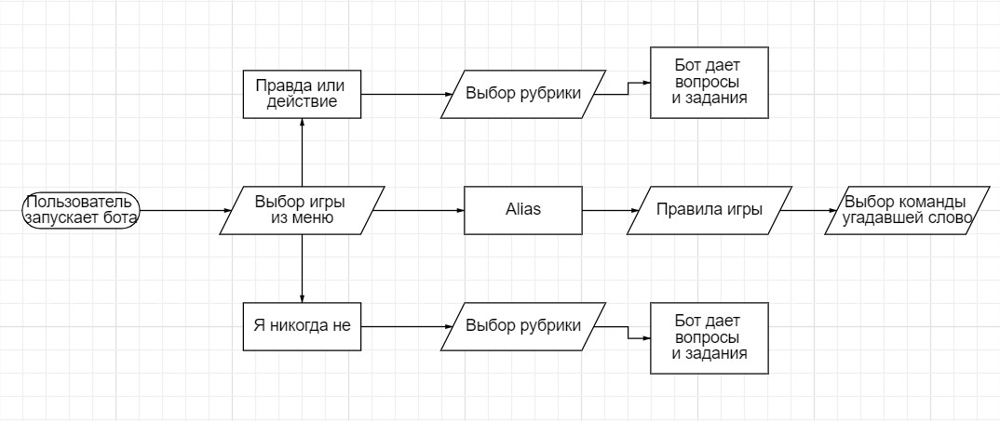
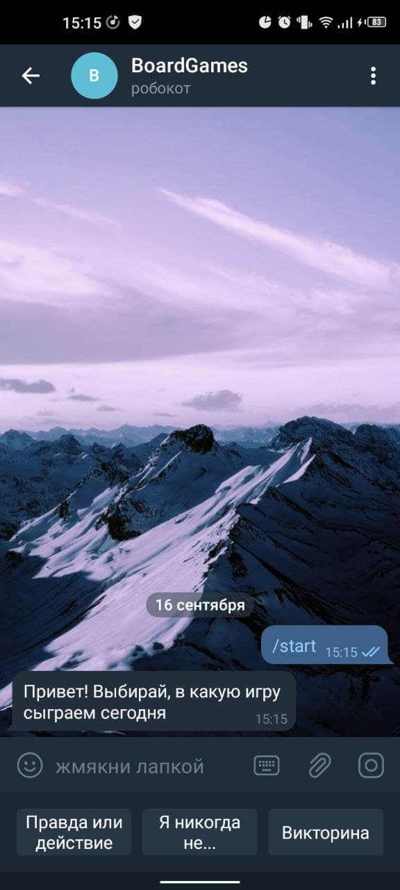
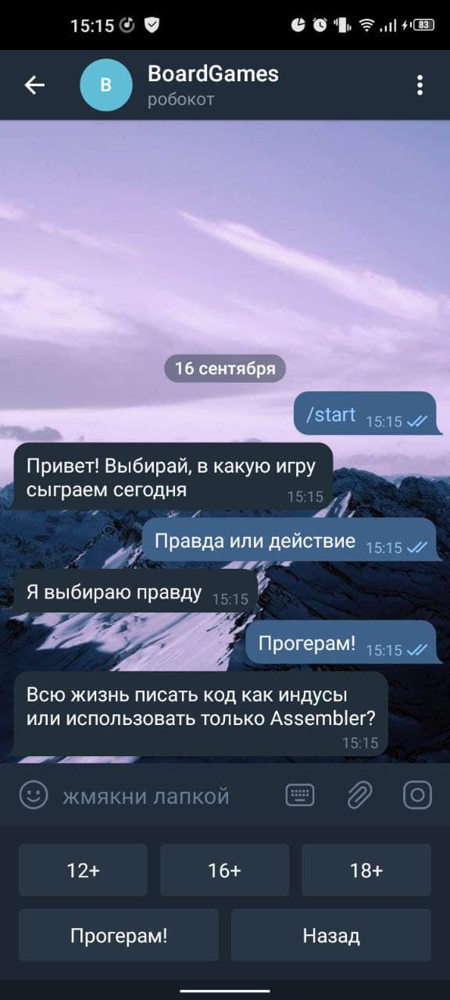

### Бот рассчитан на использование: 
* в компаниях малознакомых между собой людей, чтобы поспособствовать их открытию друг другу, выстраивания более близкой атмосферы
* для узнавания каких-то новых и неожиданных фактов в кругу друзей
* для индивидуального досуга и узнавания чего-то о себе

### Пользователям доступны: 
* игра "правда или действие" - бот дает задание, которое надо выполнить, или вопрос, на который надо честно ответить
* игра "я никогда не" - если выданное ботом действие происходило у какого-то человека, то он как-то обозначает это(загибает палец, пьет, хлопает в ладоши и прочее). если этому действию сопутствует интересная история, ее можно всем поведать
* игра "Alias" - игроки делятся на 2 команды. Командам по очереди дается слово, которое надо объяснить, не называя как само слово, так и однокоренные к нему. Угадавшей команде +1 балл

Правила в каждой игре можно интерпретировать на свой лад

Схема взаимодействия пользователя с ботом:

### Модули:
* Python 3.7
* Aiogram
* Telegram Bot API

### Интерфейс взаимодействия

### План выполнения
* Запустить бота-попугая, проверить работоспособность кода и токена
* Добавить меню(выбор игр и категорий в играх)
* Написать алгоритм переключения между меню, выбора разделов
* Добавить задания в каждый из разделов
* Подключить рандомный выбор заданий из выбранной категории
* Написать алгоритм для Alias
* Добавить контент в Alias

Результатом разработки будет являться работающий бот в Telegram, помогающий людям весело провести время в кругу друзей и знакомых
